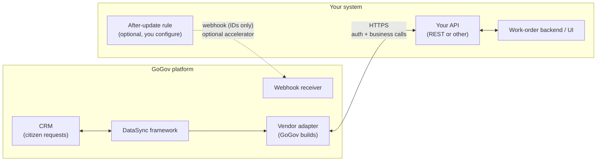
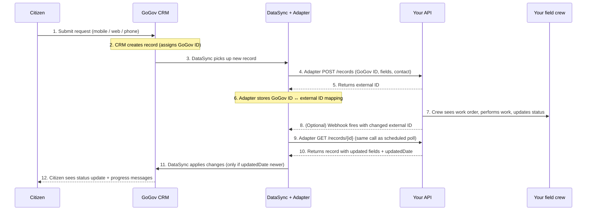

# GoGov DataSync — Partner Integration Reference

_How GoGov integrates with your record system. This repo describes the operations our vendor adapter performs against your API, with one illustrative HTTP shape as a runnable mock. Your API does not need to match the mock's exact routes or naming — our adapter translates._

---

## Table of contents

- [Who is GoGov, and why is GoGov calling your API?](#who-is-gogov-and-why-is-gogov-calling-your-api)
- [What is DataSync?](#what-is-datasync)
- [Integration model](#integration-model)
- [Endpoint reference](#endpoint-reference)
- [Data shapes](#data-shapes)
- [Authentication](#authentication)
- [Pagination](#pagination)
- [Rate limiting](#rate-limiting)
- [Error format](#error-format)
- [Contacts (requesters)](#contacts-requesters)
- [Dynamic discovery](#dynamic-discovery)
- [Testing your implementation against GoGov's expectations](#testing-your-implementation-against-gogovs-expectations)
- [Optional / future extensions](#optional--future-extensions)
- [The mock API in this repo](#the-mock-api-in-this-repo)
- [License](#license)

---

## Who is GoGov, and why is GoGov calling your API?

GoGov provides citizen-request management software (also called CRM or 311) used by city and county governments. Residents submit service requests through a mobile app, web portal, or phone — for issues like potholes, missed garbage pickup, streetlight outages, and code violations. Each request is stored in GoGov and typically needs to flow into a work-order or asset-management system (yours) where field crews actually perform the work.

GoGov's customers want both systems to stay in sync: a request created in GoGov should appear in your system; a status update entered by a field crew on your side should flow back to GoGov so the citizen sees progress. The contract in this document — and the mock in this repo — describes how GoGov makes that happen.

---

## What is DataSync?

DataSync is GoGov's integration framework. For each third-party system we integrate with, our team builds an **adapter** — code that translates between DataSync's standard operations and your system's specific API. The adapter handles authentication, record creation, polling, attachments, comments, and everything else this document covers.

**This is a request, not a specification.** We are not asking you to build an API that matches GoGov's shape. We are asking you to (a) tell us how your API works for the operations described below, and (b) tell us which capabilities you can support. Our adapter does the translation. The concrete examples in this document are *illustrative only, not prescriptive* — they show one possible shape, not a required shape.

The customer configures the integration in our admin UI: sync mode (One-Way or Two-Way), per-field direction (Push, Pull, or One-Time Push), and which optional capabilities to enable. Your API does not need to know about these settings — they shape only what our adapter chooses to call.

---

## Integration model

### Architecture



GoGov pushes records to your system through the adapter and (when configured) re-fetches known records by ID on a poll cadence. An optional webhook from your system to GoGov accelerates polling by signaling *this record changed, pull it now* — but webhook payloads contain only IDs, never field data; the actual pull always goes through your normal GET endpoint.

### Record flow

The canonical case: a citizen submits a request in GoGov, it lands in your work-order system, your crew updates the status, and the change flows back to GoGov.



The same pattern applies to comments and attachments — child records sync independently using their own GET / POST endpoints.

### Direction of flow, summarized

1. **GoGov calls you. You never have to call GoGov, except optionally to trigger an immediate pull (see below).** Your system does not need to know GoGov's URL or hold GoGov credentials for normal operation. You accept inbound HTTPS from our adapter, and that is enough.
2. **Sync flows in two directions, by two different mechanisms.**
   - **GoGov to partner is near-real-time push, standard for every integration.** When a GoGov user edits a synced record, the adapter immediately calls your record-create or record-update endpoint. There is no schedule. There is no configuration switch to turn this off; it is how DataSync works.
   - **Partner to GoGov is poll-driven.** The adapter re-fetches records it already knows about (typically by ID, in batches) on a configurable cadence — every 15 minutes is typical. Each re-fetch takes the data from the record and maps it to fields in GoGov, then hashes the record and compares that to the last hash we have for that record. If the hash changed, we know something changed on your side and we update the GoGov record. If the hash is the same, we do nothing. This is how we detect changes on your side without you having to call us.
3. **Your record IDs are authoritative.** GoGov tracks its own ID for each record. Once a record exists in your system, your ID is the one GoGov uses to read and update it.

### Triggering an immediate pull from your side (optional)

If your system can emit an event when a record changes and you want GoGov to pull the change immediately instead of waiting for the next scheduled poll, call a GoGov-hosted webhook:

```
POST https://<gogov-host>/core/webhooks/data-sync/<hash>?ids=<id1>,<id2>,...
```

| Part | Notes |
|---|---|
| `<gogov-host>` | The host of the GoGov environment the integration is configured against. Your GoGov contact provides it. |
| `<hash>` | A UUID GoGov generates when the integration is provisioned. Treat it as a shared secret; it IS the authentication (no other credentials are checked). The customer can refresh this URL on their side if it is leaked or being abused, so make the URL configurable rather than hardcoded. |
| `ids` | Comma-separated list of YOUR record IDs. Required. At least 1, at most 100 per call. **Payload is IDs only — no field data, no diff.** |

GoGov schedules a pull for each ID using the same code path as a scheduled poll, so the resulting data flow is consistent regardless of whether the trigger was webhook-driven or time-driven.

**Response (200)**

```json
{
  "message": "Successfully queued all records",
  "errors": {}
}
```

If some IDs are unknown to GoGov, de-synced, or refer to disabled records, the call still succeeds but `errors` will be populated as `{ "<external-id>": "<reason>" }` and only the valid IDs get queued. If none of the IDs are valid, the response is `400` with the same `errors` map.

This endpoint is optional. If you never call it, GoGov still picks up your changes via polling, just on the poll cadence.

### Deletes — known behavior by design

DataSync does **not** delete comments or attachments on your side. If a GoGov user deletes a comment or attachment, the corresponding item in your system is left orphaned. The same applies in the other direction — if you delete on your side, we will not pick up the deletion. This is intentional current behavior, not a requirement on your API.

---

## Endpoint reference

Every endpoint in this reference returns JSON with `Content-Type: application/json`. List endpoints return `{ items: [...], total: N }`. Timestamps are ISO 8601 with a `Z` suffix, for example `2026-05-12T14:30:00Z`.

Again: the routes and shapes below are *one viable shape* that this mock implements. The adapter will translate to whatever shape your API exposes — we just need a clear description.

### Which operations does our adapter perform?

**Create a record** is the only fully-required operation. Everything else is qualified — required for a specific capability (Two-Way sync, ongoing updates, comment sync, etc.) or recommended for ergonomics. If you cannot offer one of the qualified-required operations, the integration still works; it just turns off the capability that operation enables.

| Operation                                   | Status   | Notes |
|--------------------------------------------|----------|-------|
| Create a record                             | Required | We send field values; you return a stable, immutable external ID. |
| Update a record by ID                       | Required for ongoing updates | Without this, fields can only be set at creation. Rare but possible. |
| Get a record by ID                          | Required for Two-Way | We periodically re-fetch known records to detect vendor-side changes. |
| Reliable `updatedDate` on each record       | Required for Two-Way | Compared against our last-seen timestamp to detect changes. |
| Bulk get multiple records by IDs            | Recommended | Reduces polling overhead. We respect whatever batch limit you specify. |
| Connection-test endpoint                    | Recommended | A simple endpoint we can hit to verify reachability + credentials. **Authenticate it if possible** — verifying auth in the same call surfaces credential problems faster. If your platform cannot authenticate the test endpoint, an unauthenticated one is acceptable. |
| Field / schema discovery                    | Required for setup | Powers the field-mapping UI; setup cannot complete without it. See [Dynamic discovery](#dynamic-discovery). |
| List / create comments                      | Required for comment sync | Implement if you want comments synced. |
| List / create attachments                   | Required for attachment sync | Implement if you want attachments synced. |
| Download attachment bytes                   | Required for attachment sync | Required only if you implement attachments. |

Comments and attachments are configured per-integration on the GoGov side. If you do not implement them, the administrator simply leaves those capabilities off; everything else continues to work.

---

### Connection test — `GET /health` and `GET /`

**Status:** Recommended

The adapter calls this endpoint to verify reachability and, when possible, authentication. **Authenticate it if you can** — having auth checked in the same call as reachability surfaces credential problems faster on the customer's "Test Connection" click. An unauthenticated endpoint is acceptable if your platform requires it.

The mock leaves `/health` unauthenticated for local convenience; in your real implementation, requiring the same auth header here as on the rest of your API is preferred.

**Response (200)**

```json
{
  "success": true,
  "message": "Partner API is reachable.",
  "warnings": []
}
```

The `warnings` array is optional. Use it to surface non-fatal misconfigurations (e.g., "API version 1.2 is deprecated; please upgrade") that the administrator should see.

---

### List records — `GET /records`

**Status:** Required

List records. The primary use case from the adapter is **batch re-fetch of known records by ID** — the polling mechanism. The `updatedSince` filter and pagination are convenience extras and are not used in normal polling.

**Query parameters**

| Param | Type | Default | Description |
|---|---|---|---|
| `ids` | comma-separated string | none | Return only records whose IDs appear in this list. **This is how the adapter polls: it re-fetches the IDs it already knows about and compares `updatedAt` to detect changes.** Maximum batch size is your choice; tell us what it is. |
| `updatedSince` | ISO 8601 timestamp | none | (Optional convenience.) Return only records modified strictly after this time. Not required by the adapter — supply it only if you already publish a list-by-time pattern. |
| `limit` | integer | 10 | Page size. Maximum 100. |
| `offset` | integer | 0 | Number of records to skip. |

**Example (batch re-fetch by ID)**

```bash
curl -H "X-API-Key: demo-key-change-me" \
  "http://localhost:3000/records?ids=REQ-001,REQ-002"
```

**Response (200)**

```json
{
  "items": [
    {
      "id": "REQ-001",
      "displayId": "REQ-001",
      "updatedAt": "2026-05-12T12:30:00Z",
      "url": "https://partner.example.com/records/REQ-001",
      "fields": { "title": "Pothole on Main Street", "status": "open", "priority": "high" }
    }
  ],
  "total": 1,
  "limit": 10,
  "offset": 0
}
```

---

### Get one record — `GET /records/:id`

**Status:** Required

Fetch one record by its partner-side ID.

```bash
curl -H "X-API-Key: demo-key-change-me" http://localhost:3000/records/REQ-001
```

Returns the full record (see [Data shapes](#data-shapes)) or `404` if not found.

---

### Create a record — `POST /records`

**Status:** Required

Create a new record. The adapter calls this when a resident submits a new request through GoGov and the sync direction includes Push to your side.

**Request body**

```json
{
  "externalReference": {
    "gogovId": "9001",
    "gogovDisplayId": "GG-9001",
    "gogovUrl": "https://gogov.example.com/cases/9001"
  },
  "fields": {
    "title": "Graffiti removal request",
    "status": "open",
    "priority": "low",
    "description": "Tagging on the east wall of the library."
  }
}
```

The adapter includes our internal GoGov record ID in the create payload if you expose a field to receive it — some vendors offer a `trackingId` or `externalReference` field for exactly this purpose. It lets your operators click through to the originating record in GoGov.

**Response (201)** is the created record, including the ID your system assigned.

**Duplicate handling.** Our framework does not currently catch *already exists* errors and convert them to updates. If your API rejects a duplicate create as a failure, the adapter treats that as a failure. We recommend one of:

- **Upsert** — `POST /records` creates if new, updates if `externalReference.gogovId` already maps to an existing record.
- **Clearly distinct create and update endpoints**, with documentation describing how the adapter should pick which to call.

Either pattern is fine — tell us which applies.

---

### Update a record — `PUT /records/:id`

**Status:** Required for ongoing updates

Update an existing record. The adapter calls this whenever a synced record is edited in GoGov. Partial updates are supported; send only the fields you want to change.

```bash
curl -H "X-API-Key: demo-key-change-me" -H "Content-Type: application/json" \
  -X PUT http://localhost:3000/records/REQ-001 \
  -d '{"fields": {"status": "in_progress"}}'
```

**Response (200)** is the updated record. `updatedAt` must reflect the time of the update.

---

### List comments — `GET /records/:id/comments`

**Status:** Optional

List comments on a record. Comments include progress messages posted by staff ("crew dispatched," "materials ordered," "work completed") and follow-up communications from the citizen.

**Public vs. internal.** GoGov's CRM distinguishes between **public** comments (visible to the citizen on their request status) and **internal** comments (visible only to staff). The integration can sync either or both, depending on configuration. Your system falls into one of three patterns — tell us which:

1. **No differentiation.** Single endpoint, no visibility concept. The customer-facing UI in GoGov will let users choose to push only public items or both public + internal (with a warning that internal content will then be visible in your system since it cannot separate them); when pulling, all items are stored as public on our side.
2. **Single endpoint with a visibility field.** Tell us the field name and possible values (e.g. `visibility: "public" | "internal"`), whether it is settable on create and modifiable on update, and whether it is returned in list / get responses. **The mock in this repo implements this pattern.**
3. **Separate endpoints per visibility.** Tell us the endpoint for public items and the endpoint for internal items, and whether IDs are unified across them.

```bash
curl -H "X-API-Key: demo-key-change-me" \
  "http://localhost:3000/records/REQ-001/comments"
```

**Response (200)** (mock uses pattern #2)

```json
{
  "items": [
    {
      "id": "CMT-1",
      "message": "Crew has been dispatched.",
      "sender": { "name": "Alex Rivera", "email": "alex@partner.example.com" },
      "visibility": "public",
      "dateSent": "2026-05-12T13:00:00Z"
    },
    {
      "id": "CMT-2",
      "message": "Staff note: dispatcher flagged this area as a repeat trouble spot.",
      "sender": { "name": "Alex Rivera", "email": "alex@partner.example.com" },
      "visibility": "internal",
      "dateSent": "2026-05-12T13:30:00Z"
    }
  ],
  "total": 2
}
```

---

### Create a comment — `POST /records/:id/comments`

**Status:** Optional

Append a comment. The adapter sets `visibility` based on the GoGov-side comment it is replicating.

```json
{
  "message": "Resident confirmed via phone.",
  "sender": { "name": "Sam Inspector", "email": "sam@partner.example.com" },
  "visibility": "public"
}
```

**Response (201)** is the created comment, including its assigned `id` and `dateSent`.

---

### List attachments — `GET /records/:id/attachments`

**Status:** Optional

List attachment metadata on a record. Attachments follow the **same public/internal visibility model as comments** — three patterns, mock implements the visibility-field pattern. The mock does not store binary files; it stores metadata only. Your real implementation should do the same in this endpoint: return metadata, deliver bytes through `downloadUrl`.

**Response (200)**

```json
{
  "items": [
    {
      "id": "ATT-1",
      "name": "pothole-photo.jpg",
      "description": "Photo of the pothole submitted by the resident.",
      "fileType": "image/jpeg",
      "size": 482931,
      "visibility": "public",
      "dateUploaded": "2026-05-12T12:30:00Z",
      "downloadUrl": "https://placehold.co/600x400.jpg"
    },
    {
      "id": "ATT-2",
      "name": "internal-site-survey.pdf",
      "description": "Engineering team's internal site survey notes.",
      "fileType": "application/pdf",
      "size": 91842,
      "visibility": "internal",
      "dateUploaded": "2026-05-12T13:00:00Z",
      "downloadUrl": "https://placehold.co/600x400.pdf"
    }
  ],
  "total": 2
}
```

---

### Register an attachment — `POST /records/:id/attachments`

**Status:** Optional

Register an attachment on a record. The adapter sends the file's metadata along with a `downloadUrl` from which you can pull the file bytes if you store them.

**Upload encoding.** Tell us how you accept the file. Common patterns are `multipart/form-data` (one part for the file bytes, another for JSON metadata) and base64-encoded JSON. Either works for the adapter — we just need to know which you use. The mock accepts metadata only; it does not pull bytes.

```json
{
  "name": "site-followup.jpg",
  "description": "Follow-up photo from inspector.",
  "fileType": "image/jpeg",
  "size": 204800,
  "downloadUrl": "https://gogov.example.com/attachments/abc123",
  "visibility": "public"
}
```

**Response (201)** is the created attachment metadata.

---

### Download an attachment — `GET /records/:id/attachments/:attachmentId/download`

**Status:** Optional (required only if you implement attachments)

Return the URL from which the adapter can fetch the file bytes. The mock uses a two-step pattern (metadata GET, then download GET) so file storage can be separate from the record API and download URLs can be short-lived signed URLs if needed. The adapter is happy with either pattern: a download URL embedded in the list response, or a separate `/download` endpoint.

**File-size limits.** Tell us your maximum single-file size and accepted content types. We will respect whichever is lower between your limit and ours.

**Response (200)**

```json
{ "downloadUrl": "https://placehold.co/600x400.jpg" }
```

---

## Data shapes

### Record

```json
{
  "id": "REQ-001",
  "displayId": "REQ-001",
  "updatedAt": "2026-05-12T12:30:00Z",
  "url": "https://partner.example.com/records/REQ-001",
  "fields": { "...": "..." },
  "externalReference": {
    "gogovId": "9001",
    "gogovDisplayId": "GG-9001",
    "gogovUrl": "https://gogov.example.com/cases/9001"
  }
}
```

- **`id`** is your system's identifier for the record. String; format is your choice. Must be immutable for the life of the record — renumbering or rotating IDs will orphan records on our side. Used in all subsequent URL paths.
- **`displayId`** is what a human sees in your UI (often the same as `id`, sometimes different, e.g. `id: "9f7a-..."`, `displayId: "REQ-2026-0042"`).
- **`updatedAt`** is the last-modified timestamp, ISO 8601 with `Z`. Critical for polling; the adapter uses this to decide whether to re-sync the record. Must change whenever any tracked field, comment, or attachment changes.
- **`url`** is an optional deep link back into your UI for this record. Surfaces as a "View in partner system" link inside GoGov.
- **`fields`** is a partner-defined object whose keys correspond to the field names returned by your schema-discovery endpoint.
- **`externalReference`** is present only if the record originated in GoGov or has been linked to a GoGov record. You receive this on `POST` and `PUT`; you should persist it and echo it back on subsequent `GET`s.

### Comment

```json
{
  "id": "CMT-1",
  "message": "Crew has been dispatched.",
  "sender": { "name": "Alex Rivera", "email": "alex@partner.example.com" },
  "visibility": "public",
  "dateSent": "2026-05-12T13:00:00Z"
}
```

`visibility` is `"public"` or `"internal"`. See [List comments](#list-comments--get-recordsidcomments) for the three patterns a vendor system can use.

### Attachment

```json
{
  "id": "ATT-1",
  "name": "pothole-photo.jpg",
  "description": "Photo submitted by the resident.",
  "fileType": "image/jpeg",
  "size": 482931,
  "visibility": "public",
  "dateUploaded": "2026-05-12T12:30:00Z",
  "downloadUrl": "https://placehold.co/600x400.jpg"
}
```

- **`fileType`** is the MIME type, e.g. `image/jpeg`, `application/pdf`.
- **`size`** is in bytes, integer.
- **`visibility`** is `"public"` or `"internal"`, same model as comments.
- **`downloadUrl`** is where the adapter fetches the file bytes. Can be a signed short-lived URL.

### Field metadata

```json
{
  "name": "status",
  "type": "string | enum | date | number | boolean",
  "syncDirection": "TwoWay | Push | PushOnce | Pull",
  "required": true,
  "allowedValues": ["..."],
  "description": "Optional human-readable explanation, shown in the GoGov field-mapping UI."
}
```

#### `syncDirection` semantics

`syncDirection` tells GoGov which side is allowed to **write** the field. It is a property of the field, not of the integration as a whole.

| Value | Who writes the field | When | Example |
|---|---|---|---|
| `TwoWay` | Both sides | Either side can update on create or update; changes flow in whichever direction they originated. | `status`, `description` |
| `Push` | GoGov only | GoGov sends the value on create and update; your system stores it but never sends it back. | `priority` set by GoGov triage |
| `PushOnce` | GoGov only, first time | GoGov sends the value on the initial create. Your system preserves it; subsequent updates from GoGov are ignored for this field. | `createdAt` |
| `Pull` | Your system only | Your system sends the value to GoGov on every re-fetch. GoGov never writes it back. | `resolvedAt` driven by your workflow |

**How to choose.** If you are not sure: start with `TwoWay` for editable text and enum fields, `Pull` for timestamps your system controls, and `PushOnce` for fields you want to record once and never overwrite.

### Error

Every error response, at any status, uses this shape:

```json
{ "error": { "code": "not_found", "message": "No record with id 'REQ-9999'.", "details": { } } }
```

`details` is optional. Use it for structured information that is useful for debugging (e.g., the offending field name on a validation error). HTTP status conveys category; see the [Error format](#error-format) table.

---

## Authentication

The adapter works with whatever authentication mechanism your API uses. We currently support these patterns natively:

- **Username + password → access token.** Your token endpoint accepts user credentials and returns an access token (with refresh token and expiry). We cache the token, refresh on expiry, and send it on every request.
- **Static API key in a header or query parameter.**
- **HTTP Basic Auth.**

If your API uses a different mechanism (OAuth 2.0 client credentials, mTLS, signed requests, etc.), describe it and we will adapt.

**Our request:** document your auth flow clearly — endpoints, request and response shapes, header names, token expiry, refresh mechanics, and required scopes.

This mock supports two of the patterns above, switchable via the `AUTH_MODE` environment variable.

### Option A: API key in a header (`AUTH_MODE=apikey`)

The adapter sends a static credential in the `X-API-Key` header.

```bash
curl -H "X-API-Key: demo-key-change-me" http://localhost:3000/records
```

### Option B: HTTP Basic Auth (`AUTH_MODE=basic`)

The adapter sends `Authorization: Basic <base64(user:pass)>`.

```bash
curl -u demo:change-me http://localhost:3000/records
```

### Failure response

Missing or invalid credentials return `401`:

```json
{ "error": { "code": "unauthorized", "message": "Missing or invalid X-API-Key header." } }
```

A `401` should not leak whether the username, the password, or both were wrong.

### Production notes

- Always require TLS (HTTPS) in production. The mock listens on plain HTTP for local convenience only.
- Store credentials in a secrets manager, not in source control.

---

## Pagination

List endpoints support pagination. Any pattern works — cursor-based, offset / limit, or page-number / page-size. Tell us which you use. Include either a total count or a clear "no more results" signal (empty page, missing next token) so the adapter does not silently truncate.

The mock uses `limit` and `offset`. Default `limit` is 10, maximum is 100. Default `offset` is 0. The response includes `total` so the caller knows when to stop paging.

```bash
curl -H "X-API-Key: ..." "http://localhost:3000/records?limit=25&offset=50"
```

---

## Rate limiting

Return `429 Too Many Requests` when a caller exceeds your acceptable request rate. Two things to include:

- **`Retry-After`** header (seconds) on the `429` response. The adapter respects this and will back off accordingly.
- **Rate-limit signaling headers on every response** so the adapter can pace itself proactively. Common naming conventions are `x-ratelimit-limit`, `x-ratelimit-remaining`, and `x-ratelimit-reset` (Unix epoch), but any equivalent names are fine — we just need three pieces of information: the ceiling, the remaining budget, and when the window resets.

If you advertise your rate limits up front to your GoGov contact, we will configure our polling cadence to stay below them. The mock enforces a per-IP limit of `RATE_LIMIT_PER_MINUTE` (60 by default) requests per rolling minute.

```
HTTP/1.1 429 Too Many Requests
Retry-After: 37
Content-Type: application/json

{ "error": { "code": "rate_limited", "message": "Rate limit of 60 requests/minute exceeded." } }
```

---

## Error format

Use standard HTTP status codes — **never return `200` with an `"error"` field in the body**. Every error body uses the shape shown in [Data shapes / Error](#error). For validation failures, return field-level details so the adapter can surface something actionable to the customer.

| Status | When |
|---|---|
| `200 OK` | Successful read or update. |
| `201 Created` | Successful POST that created a new resource. |
| `400 Bad Request` | Malformed body, missing required field, invalid query parameter. |
| `401 Unauthorized` | Missing or invalid credentials. |
| `404 Not Found` | Record (or child record) does not exist. |
| `409 Conflict` | Use for, e.g., duplicate creates if you do not upsert. |
| `429 Too Many Requests` | Rate limit exceeded. Include `Retry-After` header. |
| `500 Internal Server Error` | Unexpected error. |

Do not return HTML error pages or status-code-only responses.

---

## Contacts (requesters)

Two patterns for how requester information (name, email, phone, address) is associated with a record on your side. Tell us which one applies to your system.

### Pattern A (recommended): contact fields on the main record

Your work order accepts contact details as fields directly on the record itself. This is our preferred pattern — there is nothing else to do, and you can skip the rest of this section. Validation of contact fields in GoGov depends on per-topic configuration (email may not be required, name may not be required, anonymous submissions are allowed in some configurations), which is more reliable when the contact information is just a snapshot on the work order.

### Pattern B: reference to a separate contact entity

Your work order requires a foreign-key reference (a `contactId`) to a separate contact entity that must already exist before the work order can be created. If this applies, the adapter performs a search-then-create flow on each new record.

**Operations needed:**

| Operation | Notes |
|---|---|
| Search contacts by email (preferred) or by first + last name | Required for Contact Sync. Phone-based search is not used. |
| Create a contact, returning an identifier | Required for Contact Sync. |
| Attach the contact ID to the main record | In the record-create payload or as a follow-up association call. |

We do not update matched contacts, so a matched contact's existing name / email / phone may be stale relative to the latest request — another reason Pattern A is preferred. If your contact-create endpoint allows duplicates and has no search, that is acceptable — it is functionally equivalent to Pattern A.

**Fields the adapter sends on contact create:** first name, last name (or full name), email, phone, address (line 1, line 2, city, state, postal code), and a contact type / classification if your API requires one. Tell us which fields you accept and any required picklist values.

---

## Dynamic discovery

For the customer's setup UI to display dropdowns the customer can map against, the adapter may need to discover record types, custom fields, and picklist values from your system at configuration time. Each block below is independent — implement only what applies.

The mock illustrates the **custom fields** block via `GET /fields`. Record types and picklist discovery have no mock endpoint; describe them in your API documentation if they apply.

### Record types

If your system supports defining multiple record types (each with its own fields and dropdowns), the customer needs to choose which type GoGov requests sync into.

**Required if your system supports multiple record types** — expose an endpoint returning the list of record types, each with a stable ID and display name. Skip if your system has a single, fixed record type.

### Custom fields — `GET /fields` (mock)

If your system allows agencies to add and remove fields on the work order, the customer maps each customizable field in our setup UI.

**Recommended if fields are customizable per-customer** — expose an endpoint that returns each customizable field with its stable identifier, data type (text, number, date, dropdown, boolean), and any constraints (required, max length, valid range, picklist reference). If the field set varies per record type, accept a record-type identifier on the request.

Skip if your fields are fixed in name and shape (e.g. always "User Field 1," "User Field 2") — the customer can map directly without discovery.

**Mock response (200)**

```json
{
  "items": [
    { "name": "title",       "type": "string", "syncDirection": "TwoWay",   "required": true },
    { "name": "status",      "type": "enum",   "syncDirection": "TwoWay",   "required": true,  "allowedValues": ["open","in_progress","closed"] },
    { "name": "priority",    "type": "enum",   "syncDirection": "Push",     "required": false, "allowedValues": ["low","medium","high"] },
    { "name": "description", "type": "string", "syncDirection": "TwoWay",   "required": false },
    { "name": "resolvedAt",  "type": "date",   "syncDirection": "Pull",     "required": false },
    { "name": "createdAt",   "type": "date",   "syncDirection": "PushOnce", "required": false }
  ],
  "total": 6
}
```

See [Field metadata](#field-metadata) for the shape and `syncDirection` semantics.

### Picklist / dropdown values

For any dropdown field the customer maps (Topic, Status, Priority, Department, custom dropdowns), our setup UI lets them map each GoGov value to a vendor value — for example, GoGov topic "Pothole" → vendor topic "Street Repair."

**Recommended for any field whose value is one of a fixed list** — for each dropdown, return the list of valid values with a stable identifier and a display label. If values vary per record type, accept the record-type ID on the request.

A single combined "metadata" endpoint that returns everything at once is more efficient than one endpoint per picklist; we will adapt to either pattern.

Skip if the dropdown's values are hardcoded (not customizable by agencies) — just document the valid values in your API docs and we will bake them into the adapter.

Without discovery endpoints, the customer can still hardcode values in our mapping UI, but they have to look up your values manually — through database tables, HTML source, or vendor support — which is painful and error-prone.

### Refresh cadence

The adapter calls discovery endpoints when the customer first sets up the integration and when they explicitly refresh the field-mapping UI. We do not poll continuously. **Stable identifiers matter** — if you rename a value but keep its ID, the next refresh picks it up cleanly.

---

## Testing your implementation against GoGov's expectations

Before declaring your API ready for the adapter to connect, walk through this checklist against your real implementation. The same checks pass against this mock; you can compare behavior side by side.

### Functional checks

```bash
# Connection test
curl -s http://localhost:3000/health
# Expect: 200, body { success: true, ... }

# Single record fetch
curl -s -H "X-API-Key: demo-key-change-me" http://localhost:3000/records/REQ-001
# Expect: 200, body with id, displayId, updatedAt, fields

# Polling: batch re-fetch of known records by ID
curl -s -H "X-API-Key: demo-key-change-me" \
  "http://localhost:3000/records?ids=REQ-001,REQ-002"
# Expect: 200, body { items: [...], total: N }, only the requested records

# Field metadata (powers the field-mapping UI)
curl -s -H "X-API-Key: demo-key-change-me" http://localhost:3000/fields
# Expect: 200, body with at least { name, type, syncDirection, required } per field

# Comments: verify visibility is surfaced in list responses
curl -s -H "X-API-Key: demo-key-change-me" http://localhost:3000/records/REQ-001/comments
# Expect: 200, each item has a 'visibility' field of "public" or "internal"

# Create + read-back round-trip
ID=$(curl -s -H "X-API-Key: demo-key-change-me" -H "Content-Type: application/json" \
  -X POST http://localhost:3000/records \
  -d '{"fields":{"title":"Round-trip test","status":"open"}}' | jq -r .id)
curl -s -H "X-API-Key: demo-key-change-me" "http://localhost:3000/records/$ID"
# Expect: 200, the record you just created
```

### Connection-test recipe

This is the exact sequence the adapter runs on the customer's "Test Connection" click:

```bash
# 1. Health (no auth)
curl -fsS http://localhost:3000/health > /dev/null

# 2. Auth check (any authenticated endpoint with a known-good record)
curl -fsS -H "X-API-Key: demo-key-change-me" http://localhost:3000/records?limit=1 > /dev/null

# 3. Field metadata (must return at least one field)
curl -fsS -H "X-API-Key: demo-key-change-me" http://localhost:3000/fields > /dev/null

echo "Connection test passed"
```

All three must succeed. If any fail, the administrator cannot finish configuring the integration.

### Checklist

- [ ] All timestamps are ISO 8601 with a `Z` suffix (UTC). No local time, no offsets like `+00:00`.
- [ ] Every record has an `updatedAt` field, and it changes whenever the record is mutated (including when comments or attachments are added).
- [ ] `GET /records?ids=…` returns only the requested IDs, and unknown IDs are silently omitted rather than erroring the whole call.
- [ ] Empty collections return `{ "items": [], "total": 0 }`, not `null` and not a `404`.
- [ ] Every error response uses the `{ error: { code, message } }` shape and a meaningful HTTP status.
- [ ] `401` errors do not leak whether the username, the password, or both were wrong.
- [ ] `429` responses include a `Retry-After` header; ideally also `x-ratelimit-*` headers on normal responses.
- [ ] `Content-Type: application/json` on every JSON response.
- [ ] `/health` and `/` succeed without authentication.
- [ ] `POST /records` either upserts on duplicate, or fails with a clear conflict (and your docs describe which).
- [ ] Comment and attachment list responses describe visibility — either via a `visibility` field, separate endpoints, or a clearly-documented "no differentiation" stance.
- [ ] Field / record-type / picklist discovery endpoints return stable identifiers (renaming a label keeps the ID).

### Other expectations

- **External ID stability.** Every external record (main record, comment, attachment, contact) must have an immutable identifier that does not change for the life of the record.
- **Sandbox / test environment.** Strongly recommended. If unavailable, a test record or test category in production works.
- **UI access to your system for our adapter team.** Without it, adapter builds drag from days to months because we cannot verify whether records actually landed correctly in your system. This is one of the highest-impact items in this document.

---

## Optional / future extensions

These are not part of the standard contract but may be added per partnership:

- **Bulk write endpoints** (e.g. `POST /records/batch`) for cases where the adapter needs to push many records at once during an initial backfill.
- **Additional child record types** (violations, code actions, fees, vehicles, additional addresses). The mock implements comments and attachments; richer entities follow the same nesting pattern (`GET /records/:id/<child>` and `POST /records/:id/<child>`).
- **Contact / citizen entity** for integrations where GoGov needs to push citizen information separately from the record (Pattern B above).
- **OAuth 2.0 client credentials** for partners with existing OAuth infrastructure.

If any of these apply to your integration, contact your GoGov partner success lead. We can extend the contract collaboratively without requiring you to wait for a public release.

---

## The mock API in this repo

The rest of this document explains what the mock in this repo is and how to run it. The mock is **one viable shape** an API could expose that the adapter is happy to talk to — it is not the only shape, and your API does not need to match its routes or naming.

### What this repo is

A runnable HTTP API showing one concrete shape that the DataSync adapter can integrate with. It exists so you can:

- See what a "complete" shape of the operations described above looks like, end-to-end and runnable, before describing your own.
- Compare your real API's behavior side by side against a known reference while you build or document.

### What this repo is NOT

- It is NOT a GoGov-hosted service.
- It is NOT a simulator of GoGov's DataSync code.
- It is NOT a library to depend on. You implement your own API in whatever language and framework you already use.
- It is NOT the contract you must conform to. Your API can look entirely different — the adapter translates.

### How to use this repo

1. Clone and `npm start` to bring the mock up (see [Quick start](#quick-start) below).
2. Skim the [Endpoint reference](#endpoint-reference) end-to-end. It is short.
3. Use the mock as a reference while you describe your own API to your GoGov contact (or while you fill out a partner questionnaire if we have provided one).
4. Share your base URL, credentials, and a written description of your API with your GoGov contact. GoGov builds the vendor adapter to talk to your real API.

### Quick start

You need [Node.js 20 or newer](https://nodejs.org/). To check, run `node --version`. If that prints `v20.x.x` or higher, you are set. If not, install Node first.

```bash
git clone <this-repo-url>
cd integration-doc-v1
npm install
cp .env.example .env
npm start
```

You should see output ending in:

```
{"level":30,"msg":"Server listening at http://0.0.0.0:3000"}
```

In another terminal, verify it is alive:

```bash
curl http://localhost:3000/health
```

Expected response:

```json
{"success":true,"message":"Partner API is reachable. Authentication is not checked on this endpoint."}
```

That is it. The server is now responding to every endpoint described above. See [`examples/curl.sh`](examples/curl.sh) for a full set of working curl recipes.

### Configuration reference

Every environment variable the mock reads:

| Variable | Default | Purpose |
|---|---|---|
| `PORT` | `3000` | TCP port the server listens on. |
| `AUTH_MODE` | `apikey` | `apikey` or `basic`. |
| `API_KEY` | (unset) | Required when `AUTH_MODE=apikey`. Compared against the `X-API-Key` header. |
| `BASIC_USER` | (unset) | Required when `AUTH_MODE=basic`. |
| `BASIC_PASS` | (unset) | Required when `AUTH_MODE=basic`. |
| `RATE_LIMIT_PER_MINUTE` | `60` | Per-IP requests per minute before `429`. |

The server reads a `.env` file in the project root if one exists. Otherwise, set the variables in your shell. `cp .env.example .env` is the easiest starting point.

### What's NOT in this mock (and why)

- **No persistence.** Records, comments, and attachments live in process memory and are wiped on every restart. Your real implementation obviously needs a database. The mock skips this to keep the example small and dependency-free.
- **No file storage.** Attachments are metadata only; `downloadUrl` points to a static placeholder URL. Real implementations should serve actual file bytes (or signed URLs to object storage like S3) from the `downloadUrl`.
- **No GoGov side.** This mock implements only the partner side of the picture. The GoGov-hosted inbound webhook (`POST /core/webhooks/data-sync/:hash`) and the DataSync adapter both live on GoGov infrastructure; you call them and receive calls from them, respectively, but you do not run them.
- **No retries or idempotency keys.** The adapter retries failed pushes on its side (up to 3 attempts with exponential backoff), but the mock has no idempotency handling. Production implementations should deduplicate or upsert as described under [`POST /records`](#create-a-record--post-records).
- **No TLS.** The mock listens on plain HTTP. Production deployments must use HTTPS.
- **No tests.** This is a reference implementation, not a library. The runnable curl recipes in `examples/curl.sh` double as a smoke-test suite.

---

## License

MIT. See [LICENSE](LICENSE).
